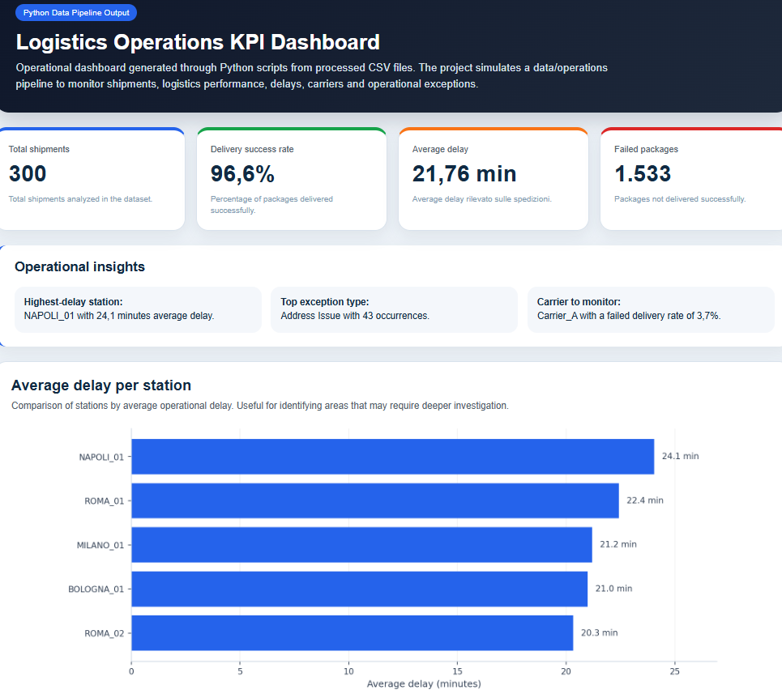

# Logistics Operations KPI Dashboard

Python data project for logistics KPI reporting, operational analysis, data cleaning and dashboard generation.

This project simulates a small logistics reporting workflow similar to what an operations or supply chain team could use to monitor shipment performance, delivery issues, delays, carrier performance and operational exceptions.

## Dashboard Preview



Final dashboard file:

`report/dashboard_logistica.html`

## Project Workflow

Synthetic data generation
Data cleaning and validation
KPI calculation
CSV export
Notebook analysis
HTML dashboard generation

## Main Features

* Synthetic logistics dataset generation
* Data cleaning and validation
* KPI calculation
* Carrier performance analysis
* Station delay analysis
* Operational exception analysis
* Reproducible pipeline with fixed random seed
* Final dashboard generated with Python
* Jupyter Notebook analysis
* GitHub-ready project structure

## KPIs Calculated

* Total shipments
* Total packages
* Delivered packages
* Failed packages
* Delivery success rate
* Failed delivery rate
* Average delay
* Delayed shipments
* Top operational exceptions

## Project Structure

```text
dashboard_kpi_logistica
├── main.py
├── README.md
├── requirements.txt
├── dati
│   ├── grezzi
│   └── elaborati
├── documenti
├── notebooks
├── report
│   ├── dashboard_logistica.html
│   ├── kpi_report.txt
│   ├── grafici
│   └── screenshots
└── sorgente
```

## Technologies Used

* Python
* CSV module
* Pathlib
* Matplotlib
* Jupyter Notebook
* HTML/CSS

All data is synthetic and generated for demonstration purposes.

## How to Run

Install requirements:

```bash
pip install -r requirements.txt
```

Run the full pipeline:

```bash
python main.py
```

This command regenerates the synthetic dataset, cleans the data, calculates KPIs, exports CSV files and generates the final dashboard.

To regenerate only the dashboard:

```bash
python sorgente/genera_dashboard_html.py
```

## Reproducibility

The synthetic dataset generation uses a fixed random seed.

This means that running:

```bash
python main.py
```

will regenerate the same dataset, KPIs, charts and final dashboard output.

## Portfolio Value

This project demonstrates the ability to:

* Structure a Python data project
* Generate and process operational data
* Validate data quality
* Calculate logistics KPIs
* Export clean datasets for reporting
* Create a reproducible dashboard
* Document a project for GitHub

The project is relevant for logistics operations, supply chain, operations analysis, KPI reporting, process improvement and junior data analysis roles.

## Notes

This is a portfolio project based on synthetic data.

The objective is not to replicate a full enterprise BI system, but to show a complete and reproducible data workflow from raw data to final reporting output.
